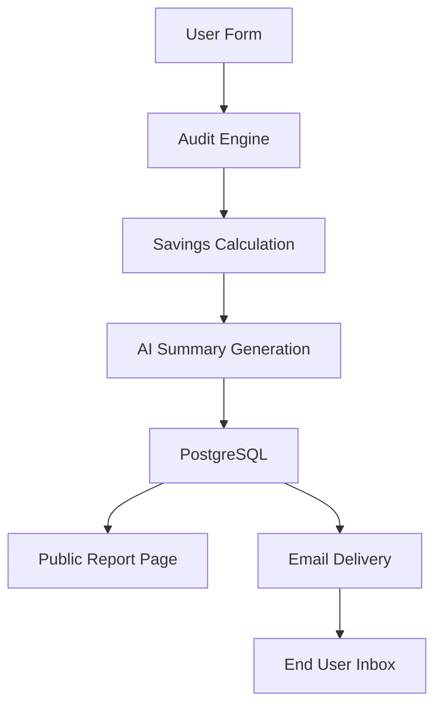
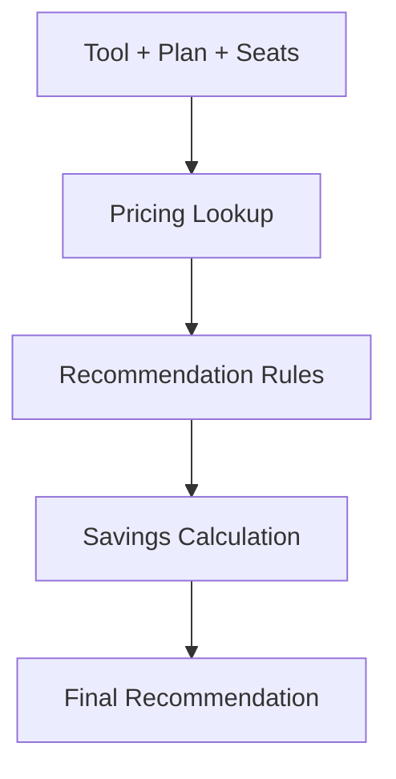

# ARCHITECTURE.md

# StackSpend Architecture

## Overview

StackSpend is a full-stack AI subscription auditing platform that helps users identify unnecessary spending across AI products and discover optimization opportunities.

The system combines:

- Rule-based cost analysis
- AI-generated executive summaries
- PostgreSQL persistence
- Shareable audit reports
- Email delivery workflows

The architecture prioritizes simplicity, transparency, and rapid iteration while remaining scalable for future growth.

---

# High-Level Architecture



---

# System Components

## Frontend Layer

### Technologies

- Next.js App Router
- React
- Tailwind CSS
- React Hook Form
- Zod

### Responsibilities

- Collect subscription information
- Validate user input
- Display recommendations
- Render AI-generated summaries
- Display savings calculations
- Show historical audits
- Present public reports

### Design Goals

- Fast user onboarding
- Minimal form friction
- Mobile-friendly experience
- Shareable reports

---

# Backend Layer

## Technologies

- Next.js Route Handlers

### Responsibilities

### Audit Generation

Receives tool subscriptions and generates:

- Monthly savings
- Annual savings
- Optimization recommendations

### AI Summary Generation

Creates executive summaries using OpenRouter.

### Lead Management

Stores:

- Email
- Company
- Role

### Email Delivery

Delivers reports through Resend.

### Report Retrieval

Provides public access to generated reports.

---

# Audit Engine

## Core Philosophy

Audit recommendations are deterministic.

The application intentionally avoids using AI for savings calculations.

Reasoning:

- Calculations must be predictable
- Results must be reproducible
- Savings must be auditable

AI is only used to explain findings.

---

## Recommendation Flow



---

# Pricing Layer

## Data Source

Pricing is maintained in:

```txt
lib/pricing-data.js
```

The pricing layer contains:

- Tool pricing
- Subscription plans
- Business plan costs
- Seat-based pricing

Supported platforms:

- ChatGPT
- Claude
- Cursor
- GitHub Copilot
- Gemini

---

# Recommendation Layer

## Rules-Based Engine

Recommendations are maintained separately in:

```txt
lib/recommendation-rules.js
```

Example:

```txt
ChatGPT Business
↓
ChatGPT Plus
↓
Save $10/month per seat
```

Benefits:

- Transparent logic
- Easy maintenance
- Predictable outcomes
- Easy testing

---

# AI Layer

## Provider

OpenRouter

## Model

GPT-4o Mini

## Responsibilities

Generate:

- Executive summaries
- Spending explanations
- Optimization narratives

AI never determines savings values.

Savings calculations originate exclusively from the audit engine.

---

# Database Layer

## Technologies

- PostgreSQL 16
- Prisma ORM

## Tables

### Audit

Stores:

- Public report identifier
- Savings metrics
- AI summary
- Metadata

### Tool

Stores:

- Tool name
- Plan
- Monthly spend
- Seat count

### Lead

Stores:

- Email
- Company
- Role

---

# Public Reports

Reports use generated public identifiers.

Example:

```txt
/reports/cmcz123abc456
```

Advantages:

- Shareable URLs
- No database ID exposure
- Reduced enumeration risk

---

# Security Considerations

## Public Report Privacy

Public reports exclude:

- Email addresses
- Company information
- Personal identifiers

Only audit-related information is displayed.

---

## Spam Prevention

Lead forms include a honeypot field.

Purpose:

- Block automated submissions
- Prevent low-quality leads
- Reduce spam traffic

---

# Testing Strategy

## Audit Engine Tests

Coverage includes:

- Recommendation generation
- Monthly savings calculations
- Annual savings calculations
- Optimized stack detection
- Multi-tool audits

Testing framework:

```txt
Vitest
```

---

# CI/CD

## GitHub Actions

Pipeline executes on:

- Push
- Pull Request

Checks:

1. Dependency installation
2. ESLint validation
3. Audit engine tests

This prevents regressions before deployment.

---
# Why This Stack

## Next.js

Chosen because it provides:

- Server Components
- API routes
- SSR support
- Easy Vercel deployment

This reduced complexity by allowing frontend and backend logic to live in a single codebase.

## PostgreSQL + Prisma

Chosen because:

- Strong relational modeling
- Type-safe queries
- Excellent developer experience
- Easy future scaling

## OpenRouter

Chosen because:

- Single API integration
- Access to multiple frontier models
- Easy provider switching

## Tailwind CSS

Chosen because:

- Rapid UI development
- Consistent design system
- Small bundle size

# Scalability Considerations

If StackSpend scaled to 10,000+ audits per day:

### Move Summary Generation To Queues

Current:

```txt
Request → AI → Response
```

Future:

```txt
Request → Queue → Worker → Database
```

Benefits:

- Faster response times
- Reduced API bottlenecks

---

### Redis Caching

Cache:

- Public reports
- Pricing data
- Recommendation results

Benefits:

- Reduced database load
- Faster report rendering

---

### Database Scaling

Potential upgrades:

- Read replicas
- Connection pooling
- Query optimization

---

### CDN Distribution

Public reports could be cached globally through a CDN.

Benefits:

- Lower server load
- Faster international access

---

# Architectural Tradeoffs

## Rules Instead Of AI Recommendations

Chosen because:

- Deterministic
- Explainable
- Easy to test

Tradeoff:

- Less adaptive than ML-driven optimization.

---

## Static Pricing Data

Chosen because:

- Fast implementation
- Predictable calculations

Tradeoff:

- Requires manual updates when vendor pricing changes.

---

## Public Reports Without Authentication

Chosen because:

- Lower friction
- Easier sharing

Tradeoff:

- Public links must remain non-sensitive.

---

# Future Architecture Improvements

- User authentication
- Team workspaces
- Organization dashboards
- Automated pricing synchronization
- PDF export service
- Usage-based optimization
- Vendor benchmark comparisons